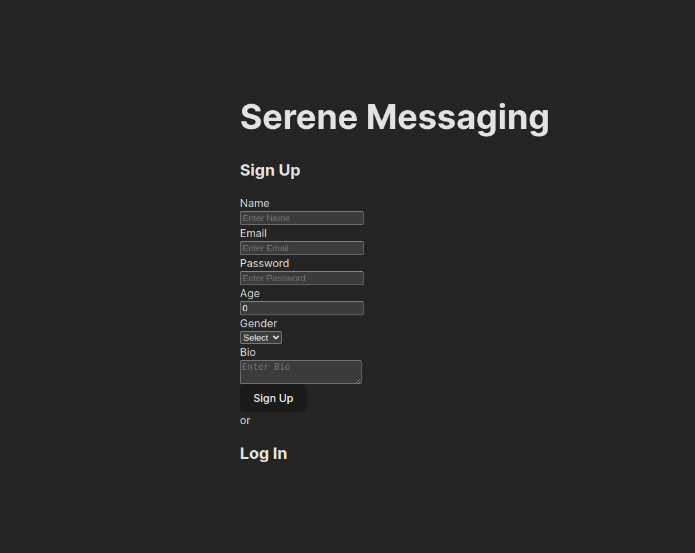
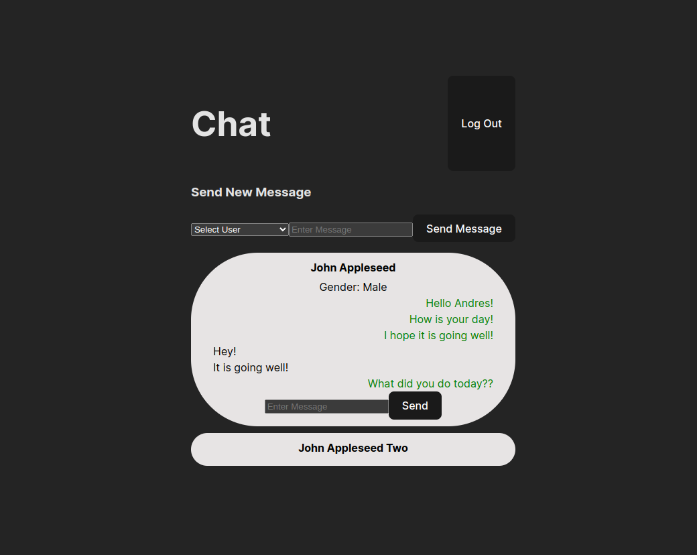

# Serene Messaging

The Odin Project: Messaging app

## Description

This project was meant as practice for creating full stack apps. This app is a messaging app, similar to discord ,whatsapp, or kik. It allows you to create an account and send a message to other users privately.

It includes a simple login/signup home page

and a simple chatting page, where you click on users to expand the groupchat and continue chatting

## Tech stack

       

This uses React in the frontend, with an express and node backend. The database being used is a MongoDB database, being connected with Mongoose. Bcryptjs is also being used in conjunction with JWT tokens to provide authentication to users when they log in.
